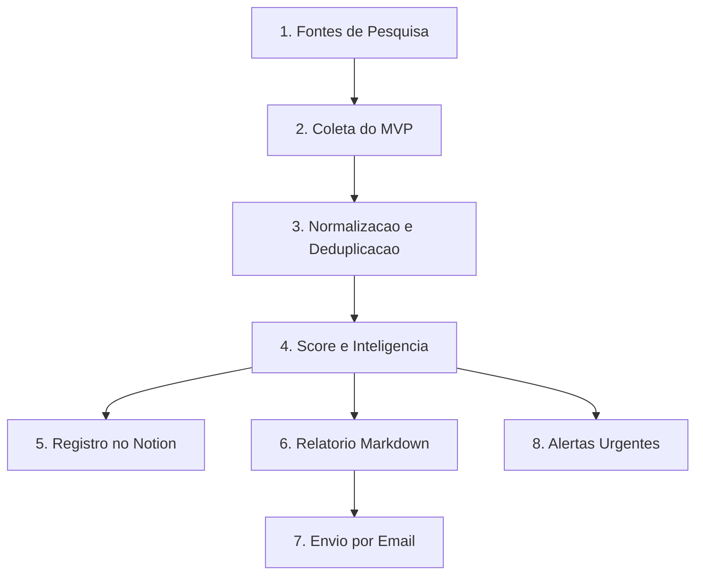
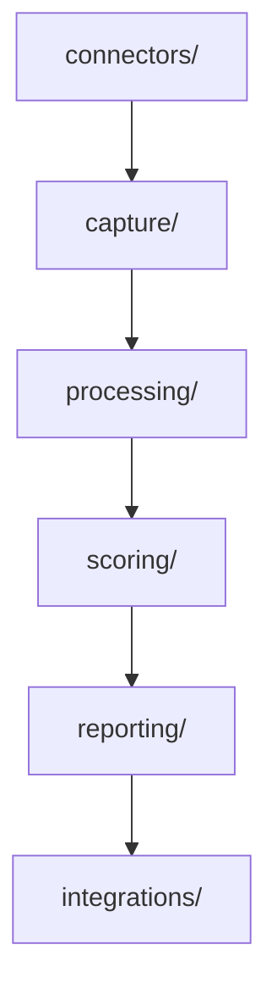
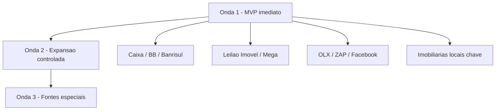

# Arquitetura Visual Profissional

## Visao executiva

O agente imobiliario foi estruturado como uma plataforma em camadas.

O objetivo e evitar um sistema bonito na teoria e fraco na pratica.

A arquitetura abaixo foi desenhada para:

- capturar oportunidades com amplitude
- limpar e organizar dados com disciplina
- priorizar com criterio economico e operacional
- registrar decisao no Notion
- gerar relatorio executivo e alertas

## Fluxo macro

## Camadas operacionais

```mermaid
flowchart LR
    subgraph S1["Camada 1 - Origem"]
        A1["Bancos"]
        A2["Leiloeiros"]
        A3["Agregadores"]
        A4["Portais"]
        A5["Marketplace"]
        A6["Imobiliarias Locais"]
        A7["Fontes Publicas"]
    end

    subgraph S2["Camada 2 - Ingestao"]
        B1["Conectores MVP"]
        B2["Coleta Estruturada"]
        B3["Captura Bruta"]
    end

    subgraph S3["Camada 3 - Processamento"]
        C1["Padronizacao"]
        C2["Geofiltro"]
        C3["Filtro de Data"]
        C4["Deduplicacao"]
    end

    subgraph S4["Camada 4 - Inteligencia"]
        D1["Regua de Score v1"]
        D2["CMA / Preco m2"]
        D3["Tese do Ativo"]
        D4["Decisao Preliminar"]
    end

    subgraph S5["Camada 5 - Entrega"]
        E1["Notion"]
        E2["Markdown"]
        E3["Gmail"]
        E4["Alertas"]
    end

    S1 --> S2 --> S3 --> S4 --> S5
```

## Mapa dos modulos

## Prioridade de implantacao

## Regra de arquitetura

- nenhuma fonte nova entra sem estabilidade da anterior
- o dado bruto nunca pula direto para a decisao
- o score organiza prioridade, mas nao substitui julgamento executivo
- o Notion e o centro operacional
- o relatorio precisa existir em markdown, Notion e email
