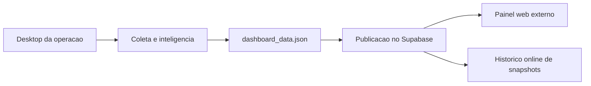

# Dashboard Online com Banco de Dados Gratuito

## Leitura do cenario

O melhor desenho para o seu caso e este:

- o desktop continua sendo o motor de coleta e inteligencia
- o desktop gera o `dashboard_data.json`
- no fim da rotina ele publica esse snapshot em um banco online
- o dashboard externo passa a ler essa base online

Assim, voce nao depende da rede do supermercado para visualizar os dados.

## Recomendacao executiva

Hoje a melhor escolha para este projeto e `Supabase`.

Motivos:
- tem `500 MB` de banco gratuito por projeto no plano Free, segundo a documentacao oficial do Supabase
- ainda oferece `1 GB` de storage no Free
- entrega Postgres, REST API e auth no mesmo ecossistema
- simplifica muito a leitura do dashboard fora da rede interna

Fontes oficiais:
- [Supabase billing](https://supabase.com/docs/guides/platform/billing-on-supabase)
- [Neon pricing](https://neon.com/pricing)
- [Turso pricing](https://turso.tech/pricing)

Leitura estrategica:
- `Supabase` e a opcao mais equilibrada para o seu painel porque une banco, API e evolucao futura de auth.
- `Neon` tambem e bom, mas o plano Free atual trabalha com `0.5 GB por projeto` e ele e mais focado em Postgres puro.
- `Turso` tem limite gratuito bem generoso, mas o encaixe para este painel executivo e menos natural do que Supabase se comparado ao que voce quer construir.

## Arquitetura recomendada



## O que foi preparado no projeto

### Integracao pronta para publicacao online
- `src/agente_imoveis/integrations/supabase_sync.py`
- `scripts/publicar_dashboard_online.py`
- `scripts/executar_pipeline_dashboard_online.py`
- `publicar_dashboard_online.bat`
- `config/supabase_online_sync.example.json`

### O que esse bloco faz
- le o `dashboard_data.json`
- publica um snapshot atual em `dashboard_current`
- grava historico em `dashboard_history`

## Tabelas recomendadas no Supabase

SQL sugerido:

```sql
create table if not exists public.dashboard_current (
  dashboard_slug text primary key,
  generated_at timestamptz,
  executed_at timestamptz,
  project_stage text,
  dashboard_stage text,
  records_total integer,
  radar_matches integer,
  investment_attack_now integer,
  payload jsonb not null
);

create table if not exists public.dashboard_history (
  id bigint generated always as identity primary key,
  dashboard_slug text not null,
  generated_at timestamptz,
  executed_at timestamptz,
  payload jsonb not null
);
```

## Variaveis necessarias

No desktop que executa a rotina:

```powershell
$env:SUPABASE_URL="https://SEU-PROJETO.supabase.co"
$env:SUPABASE_SERVICE_ROLE_KEY="SUA_SERVICE_ROLE_KEY"
```

Opcionais:

```powershell
$env:SUPABASE_CURRENT_TABLE="dashboard_current"
$env:SUPABASE_HISTORY_TABLE="dashboard_history"
$env:SUPABASE_DASHBOARD_SLUG="agente-imoveis"
```

## Publicacao manual

Depois de gerar o dashboard local:

```powershell
python .\scripts\publicar_dashboard_online.py
```

Ou pelo pipeline completo:

```powershell
python .\scripts\executar_pipeline_dashboard_online.py
```

Ou com duplo clique:

- `publicar_dashboard_online.bat`

## Como isso ficara na pratica

### Atualizacao
- o desktop roda normalmente
- no fim do fluxo, publica o snapshot no Supabase
- o painel externo consulta o snapshot atual no banco online

### Vantagem real
- acesso fora da rede do supermercado
- historico centralizado
- base unica para equipe, diretoria e parceiros autorizados

## O que ainda preciso de voce para fechar 100%

- `SUPABASE_URL`
- `SUPABASE_SERVICE_ROLE_KEY`
- confirmacao se vamos usar `Supabase`

## Melhor caminho

Se eu estivesse decidindo como dono:

1. usar `Supabase Free` como camada online agora
2. manter o desktop como motor principal
3. publicar o snapshot do dashboard no Supabase
4. depois subir uma versao web externa lendo essa base online

Esse e o caminho mais inteligente, rapido e com melhor custo-beneficio no seu caso hoje.
