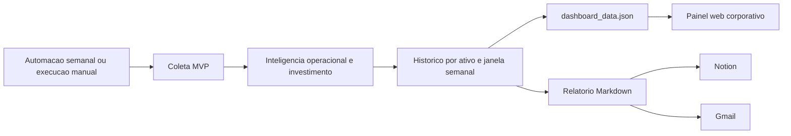

# Painel Web Executivo Compartilhado

## Leitura do cenario

O painel entrou em fase corporativa. Ele agora deixa de depender de chave simples na URL e passa a operar com autenticacao por usuario, sessao e perfis de acesso.

## Como sera atualizado

O painel continua sendo atualizado por duas rotas:

1. Atualizacao automatica semanal
- toda segunda-feira, as 10:00
- executa captura MVP
- recalcula inteligencia operacional e score de investimento
- atualiza historico por ativo e janela semanal
- regenera o JSON do dashboard
- gera o relatorio executivo
- publica no Notion
- envia resumo por Gmail

2. Atualizacao manual sob demanda
- executar `abrir_painel_dashboard.bat`
- ou `abrir_painel_dashboard_corporativo.bat`
- isso regenera a base do dashboard e sobe o servidor web

## Arquitetura de atualizacao

## Acesso corporativo

### Modo interno corporativo
- arquivo: `abrir_painel_dashboard_corporativo.bat`
- sobe o painel em `0.0.0.0:8765`
- exige login por usuario
- cria sessao HTTP-only no navegador

### Modo HTTPS modelo
- arquivo: `abrir_painel_dashboard_https_modelo.bat`
- deve ser ajustado com os caminhos reais do certificado e da chave privada
- ao preencher os caminhos corretos, o servidor sobe com HTTPS

## Usuarios iniciais configurados

Arquivo:
- `config/painel_usuarios.json`

Usuarios iniciais:
- `wagner.admin`
- `diretoria.indio`
- `expansao.indio`

Senhas fortes atuais:
- `wagner.admin` -> `Wag#Radar_2026!Prime`
- `diretoria.indio` -> `Dir#Expansao_2026!Visao`
- `expansao.indio` -> `Exp#Ativos_2026!Mapa`

Recomendacao:
- se desejar, rotacionar novamente antes de ampliar o acesso para mais pessoas
- usar `scripts/rotacionar_senha_usuario_painel.py` para futuras trocas

## Perfis de acesso

- `admin`
  - visao total do painel
  - preparado para futuras camadas de administracao
- `diretoria`
  - acesso executivo ao dashboard e relatorios
- `analista`
  - acesso operacional ao painel
- `consulta`
  - perfil previsto para futura expansao

## O que a equipe vera

- login corporativo
- status da operacao
- ultima execucao validada
- links de acesso local e de rede
- indicacao se o acesso esta em HTTP interno ou HTTPS
- KPIs do radar
- distribuicao por decisao operacional
- distribuicao por decisao de investimento
- panorama geografico
- fontes lideres e bloqueios
- historico das ultimas execucoes
- historico dos ultimos relatorios
- movimento semanal:
  - entrou
  - mudou
  - saiu
- tabela priorizada das oportunidades

## Recomendacao executiva

Para uso corporativo imediato, o melhor caminho agora e:

1. usar `abrir_painel_dashboard_corporativo.bat`
2. validar o acesso em maquinas da rede interna
3. validar se quer manter ou trocar as senhas fortes atuais
4. depois configurar certificado e migrar para HTTPS

## O que falta para nivel corporativo completo

- publicar em servidor fixo dedicado
- colocar HTTPS definitivo com certificado valido
- criar gestao de usuarios via interface
- registrar auditoria de acesso
- criar perfis por area ou nivel de permissao
- opcionalmente publicar atras de proxy reverso com dominio interno
